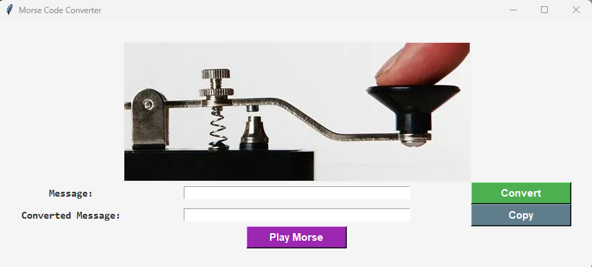

# Morse Code Converter 🔤➡️

A simple Python application that converts text into Morse code using a dictionary-based approach.  
The project also includes a graphical user interface built with Tkinter.

---

## 🚀 Features

- Convert text to Morse code
- Handles spaces between words using `/`
- Error handling for unsupported characters
- Simple GUI using Tkinter
- Copy result to clipboard
- Clean and interactive interface
- Plays the morse code

---

## 🖥️ Technologies Used

- Python 3
- Tkinter (GUI)
- Winsound

---

## 🖼 Preview

